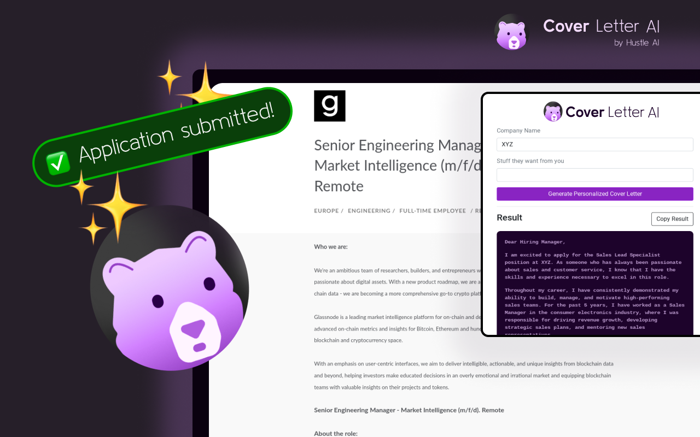

# Personalized-Cover-Letter-Generator

This project is an open-source Chrome extension designed to generate personalized cover letters with ease. The project is proudly brought to you by Hustle AI.

## Table of Contents
- [Installation](#installation)
- [Features](#features)
- [Usage](#usage)
- [Contributing](#contributing)
- [License](#license)

## Installation
1. Go to the [Chrome web store](https://chrome.google.com/webstore/detail/hustle-ai-cover-letter-ge/dgjdbchfennehcpmeappmefbbofdlaab)
2. Click on "Add to Chrome"
3. Confirm the installation dialog and the extension will be added to your Chrome browser.

## Features
- Generates personalized cover letters based on your input.
- Saves your cover letter drafts, so you can revisit and refine them anytime.
- Built-in cover letter templates that you can use and customize.

## Usage
After successful installation, click on the extension icon on your Chrome toolbar. A popup will display a form where you can input your details and the job description. Based on your input, the AI will generate a personalized cover letter for you.

## Contributing
We love contributions from the community! Please feel free to submit issues for bugs, new feature requests, or even pull requests with your own improvements. See [CONTRIBUTING.md](CONTRIBUTING.md) for more details.

## License
This project is licensed under the terms of the MIT license. For more details, see [LICENSE](LICENSE).
